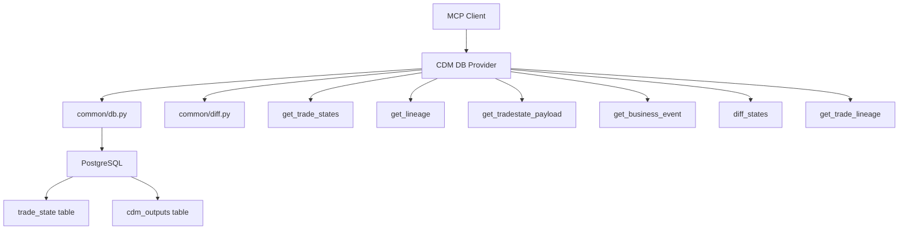

# CDM Database MCP Provider

A read-only Model Context Protocol (MCP) provider for querying Common Domain Model (CDM) trade states, business events, and lineage from PostgreSQL.

## Purpose

This provider exposes tools that agents and UIs can use to:

- Query trade state lineage and history
- Retrieve business event details
- Compare trade states to understand changes
- Navigate the CDM trade lifecycle

## Available Tools

### `get_trade_states(trade_id: str)`

Get all states for a trade ordered by version.

**Parameters:**

- `trade_id`: Logical trade identifier

**Returns:**

```json
{
  "trade_id": "IRS-2025-001",
  "states": [
    {
      "trade_state_id": "TS-IRS-001-EXEC",
      "version": 1,
      "position_state": "EXECUTED",
      "event_id": "EVT-IRS-001-EXEC",
      "before_state_id": null,
      "as_of": "2025-01-02T10:30:00"
    }
  ]
}
```

### `get_lineage(trade_state_id: str)`

Get before/after relationships, intent, and effective date for a trade state.

**Parameters:**

- `trade_state_id`: State identifier

**Returns:**

```json
{
  "trade_id": "IRS-2025-001",
  "event_id": "EVT-IRS-001-CONF",
  "before": "TS-IRS-001-EXEC",
  "after": ["TS-IRS-001-CLEAR"],
  "position_state": "CONFIRMED",
  "closed_state": null,
  "effectiveDate": "2025-01-03T14:15:00",
  "intent": "ContractFormation"
}
```

### `get_tradestate_payload(trade_state_id: str)`

Get full TradeState JSON payload.

**Parameters:**

- `trade_state_id`: State identifier

**Returns:** Full CDM TradeState JSON object

### `get_business_event(event_id: str)`

Get full BusinessEvent JSON payload.

**Parameters:**

- `event_id`: Event identifier

**Returns:** Full CDM BusinessEvent JSON object

### `diff_states(from_state_id: str, to_state_id: str)`

Compare two trade states showing changes and appends.

**Parameters:**

- `from_state_id`: Source state identifier
- `to_state_id`: Target state identifier

**Returns:**

```json
{
  "header": {
    "from_state_id": "TS-IRS-001-EXEC",
    "to_state_id": "TS-IRS-001-CONF"
  },
  "changes": {
    "notional": { "from": null, "to": 1000000, "changed": true },
    "fixedRate": { "from": null, "to": 0.045, "changed": true },
    "positionState": { "from": "EXECUTED", "to": "CONFIRMED", "changed": true }
  },
  "appends": {
    "resetHistory": [],
    "transferHistory": []
  }
}
```

### `get_trade_lineage(trade_id: str)`

Get complete timeline lineage for a trade with enriched event data. This tool is optimized for building UI timeline views and returns all states with enriched information including intent, effectiveDate, event type mappings, and relationships in a single call.

**Parameters:**

- `trade_id`: Logical trade identifier

**Returns:**

```json
{
  "trade_id": "TRD-2024-001",
  "timeline": [
    {
      "trade_state_id": "TS-001",
      "version": 1,
      "event_id": "EVT-001-EXEC",
      "position_state": "EXECUTED",
      "closed_state": null,
      "event_type": "Execution",
      "intent": "Execution",
      "date": "2024-01-14T10:00:00",
      "as_of": "2024-01-14T10:00:00",
      "before_state_id": null,
      "after_state_ids": ["TS-002"]
    },
    {
      "trade_state_id": "TS-002",
      "version": 2,
      "event_id": "EVT-002-CONF",
      "position_state": "CONFIRMED",
      "closed_state": null,
      "event_type": "Confirmation",
      "intent": "ContractFormation",
      "date": "2024-01-15T14:00:00",
      "as_of": "2024-01-15T14:00:00",
      "before_state_id": "TS-001",
      "after_state_ids": ["TS-003"]
    },
    {
      "trade_state_id": "TS-003",
      "version": 3,
      "event_id": "EVT-003-AMEND",
      "position_state": "CONFIRMED",
      "closed_state": null,
      "event_type": "Amendment",
      "intent": "ContractAmendment",
      "date": "2024-06-19T09:00:00",
      "as_of": "2024-06-19T09:00:00",
      "before_state_id": "TS-002",
      "after_state_ids": ["TS-004"]
    },
    {
      "trade_state_id": "TS-004",
      "version": 4,
      "event_id": "EVT-004-SETTLE",
      "position_state": "CLEARED",
      "closed_state": null,
      "event_type": "Settlement",
      "intent": "Settlement",
      "date": "2024-07-14T16:00:00",
      "as_of": "2024-07-14T16:00:00",
      "before_state_id": "TS-003",
      "after_state_ids": []
    }
  ]
}
```

**Key Features:**

- **Complete Timeline**: Returns all states for a trade ordered by version (chronologically)
- **Enriched Data**: Each timeline entry includes intent and effectiveDate from BusinessEvent
- **Event Type Mapping**: Maps CDM intent/position_state to UI-friendly event types (Execution, Confirmation, Amendment, Settlement, etc.)
- **Relationship Information**: Includes before_state_id and after_state_ids for navigation
- **UI Optimized**: Designed for building timeline UIs with minimal API calls (one call gets all data)
- **Error Handling**: If lineage lookup fails for a state, basic information is still returned

**Event Type Mappings:**

- `Execution` → Execution events
- `ContractFormation` → Confirmation events
- `ContractAmendment` → Amendment events
- `Termination` → Termination events
- `Settlement` → Settlement events
- Falls back to position_state mapping if intent is not available

## How to Run

1. Ensure PostgreSQL database is running with CDM demo data
2. Set up environment variables (see Configuration)
3. Run the provider:

```bash
cd cdm-agent
source .venv/bin/activate
python providers/cdm_db/provider.py
```

## Configuration

The provider uses environment variables for database connection:

```bash
PGHOST=localhost
PGPORT=5432
PGDATABASE=cdm_demo
PGUSER=cdm
PGPASSWORD=cdm
```

These can be set in a `.env` file in the `cdm-agent` root directory.

## Database Schema

### `trade_state` Table

- `trade_state_id`: Primary key
- `trade_id`: Logical trade identifier
- `version`: State version number
- `position_state`: Current position state (EXECUTED, CONFIRMED, etc.)
- `closed_state`: Closure reason if applicable
- `event_id`: Associated business event
- `before_state_id`: Previous state (for lineage)
- `as_of`: Timestamp

### `cdm_outputs` Table

- `id`: Primary key
- `object_type`: Type (BusinessEvent, TradeState)
- `trade_id`: Associated trade
- `event_id`: Associated event
- `trade_state_id`: Associated state
- `payload_json`: Full CDM JSON payload
- `payload_sha256`: Content hash
- `created_at`: Creation timestamp

## Example Usage Patterns

### Trade Lifecycle Timeline (Recommended)

```python
# Get complete timeline with enriched data in one call
timeline = await get_trade_lineage("TRD-2024-001")

# Build UI timeline from the response
for event in timeline["timeline"]:
    print(f"{event['event_type']} on {event['date']}")
    print(f"  Intent: {event['intent']}")
    print(f"  Position: {event['position_state']}")
```

### Trade Lifecycle Analysis

```python
# Get all states for a trade
states = await get_trade_states("IRS-2025-001")

# Analyze each state transition
for state in states["states"]:
    lineage = await get_lineage(state["trade_state_id"])
    print(f"State: {state['position_state']}, Intent: {lineage['intent']}")
```

### State Comparison

```python
# Compare two states to see what changed
diff = await diff_states("TS-IRS-001-EXEC", "TS-IRS-001-CONF")
print(f"Notional changed: {diff['changes']['notional']['changed']}")
```

### Event Analysis

```python
# Get business event details
event = await get_business_event("EVT-IRS-001-CONF")
print(f"Event intent: {event['intent']}")
```

## Dependencies

- `mcp`: Model Context Protocol server
- `psycopg2-binary`: PostgreSQL adapter
- `python-dotenv`: Environment variable loading
- `pydantic`: Data validation
- `asyncio`: Async support

## Architecture




