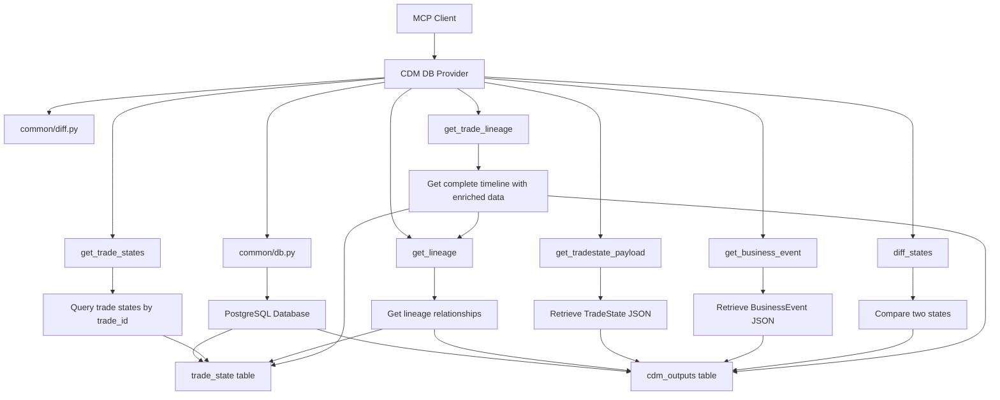
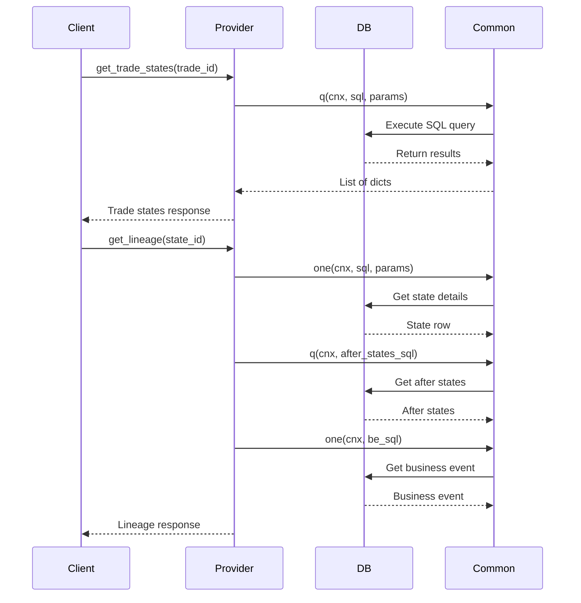
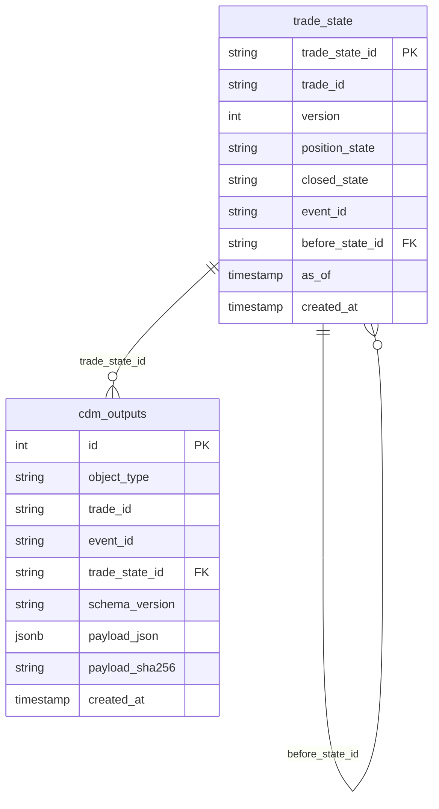
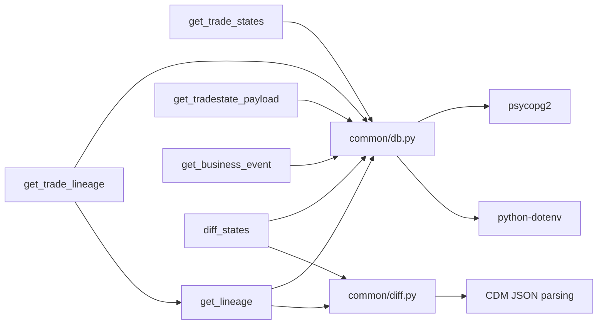

# CDM Database MCP Provider Architecture

## System Overview

```mermaid
graph TD
    A[MCP Client] --> B[CDM DB Provider]
    B --> C[common/db.py]
    B --> D[common/diff.py]
    C --> E[PostgreSQL Database]
    E --> F[trade_state table]
    E --> G[cdm_outputs table]

    B --> H[get_trade_states]
    B --> I[get_lineage]
    B --> J[get_tradestate_payload]
    B --> K[get_business_event]
    B --> L[diff_states]
    B --> M[get_trade_lineage]

    H --> N[Query trade states by trade_id]
    I --> O[Get lineage relationships]
    J --> P[Retrieve TradeState JSON]
    K --> Q[Retrieve BusinessEvent JSON]
    L --> R[Compare two states]
    M --> S[Get complete timeline with enriched data]

    N --> F
    O --> F
    O --> G
    P --> G
    Q --> G
    R --> G
    S --> F
    S --> G
    S --> I
```

## Data Flow

```mermaid
sequenceDiagram
    participant Client
    participant Provider
    participant DB
    participant Common

    Client->>Provider: get_trade_states(trade_id)
    Provider->>Common: q(cnx, sql, params)
    Common->>DB: Execute SQL query
    DB-->>Common: Return results
    Common-->>Provider: List of dicts
    Provider-->>Client: Trade states response

    Client->>Provider: get_lineage(state_id)
    Provider->>Common: one(cnx, sql, params)
    Common->>DB: Get state details
    DB-->>Common: State row
    Provider->>Common: q(cnx, after_states_sql)
    Common->>DB: Get after states
    DB-->>Common: After states
    Provider->>Common: one(cnx, be_sql)
    Common->>DB: Get business event
    DB-->>Common: Business event
    Provider-->>Client: Lineage response
```

## Database Schema Relationships

```mermaid
erDiagram
    trade_state {
        string trade_state_id PK
        string trade_id
        int version
        string position_state
        string closed_state
        string event_id
        string before_state_id FK
        timestamp as_of
        timestamp created_at
    }

    cdm_outputs {
        int id PK
        string object_type
        string trade_id
        string event_id
        string trade_state_id FK
        string schema_version
        jsonb payload_json
        string payload_sha256
        timestamp created_at
    }

    trade_state ||--o{ trade_state : "before_state_id"
    trade_state ||--o{ cdm_outputs : "trade_state_id"
```

## Tool Dependencies

```mermaid
graph LR
    A[get_trade_states] --> B[common/db.py]
    C[get_lineage] --> B
    C --> D[common/diff.py]
    E[get_tradestate_payload] --> B
    F[get_business_event] --> B
    G[diff_states] --> B
    G --> D
    H[get_trade_lineage] --> B
    H --> C

    B --> I[psycopg2]
    B --> J[python-dotenv]
    D --> K[CDM JSON parsing]
```
